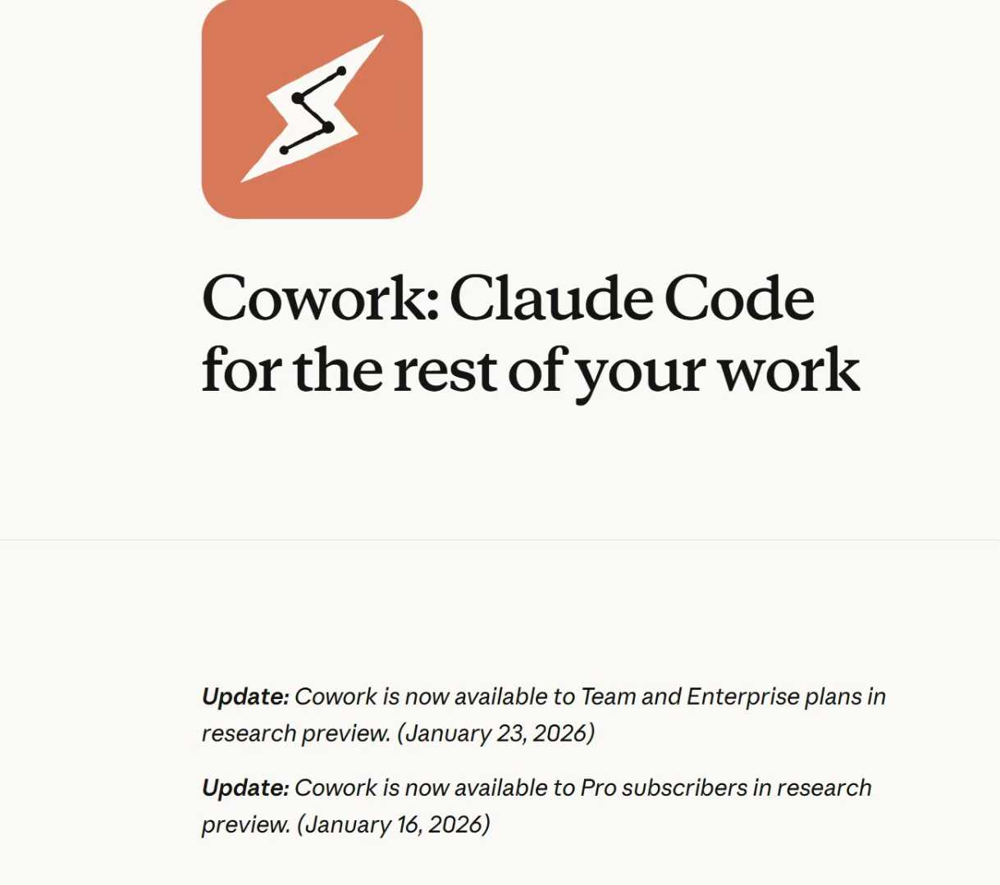

# 高不确定性时代的生存法则：从“逐行编码”到“管理确定性”的思维跃迁

AI能帮我们做这么多事，人的价值在哪里？先来看看行业前沿的状况：26年来很明显multi agents系统开始慢慢落地，openai用agent迭代出了新的gpt 5.3 codex；claude的opus 4.6大幅增加了agent能力，成为了在claude cowork这个今年1月才诞生的给非程序员用的“claude code“产品中，最好的基座模型。当AI系统开始越来越复杂，能帮我们做的事情越来越多，不止是编码，还有整个软件工程的部署，测试，运维，监控等一系列领域，还有除了软件以外的几乎所有领域，娱乐，外卖，学习，办公......衣食住行无所不在只是时间问题。

系统变复杂了，能做到的事情越来越多，不确定性就越来越大。真实的商业战场中，迭代速度就是生命，而随着AI能做的事情越来越多，对产品的要求也水涨船高，产品的高质量要求和产品的高迭代速度要求，使得人们必须用AI去做至少8成的任务，但AI的极速生产力使得人们并不能适应这种高不确定性，因为AI短时间生产的内容已经超出了人类能完全掌控的生理极限。这就是高不确定性。未来人的核心价值在于，在高不确定性中管理确定性的能力。传统的SE本来就是这样，AI只会让这点雪上加霜。所以测试很重要，传统的SE在系统大成的后期已经开始几乎只信完善的测试，而不是逐行的分析。没有人能够逐行分析清楚，这点和几乎在所有人刚刚学习计算机的时候的直觉是完全相反的。SE就是一个如此反直觉的东西，当我们刚刚学习编程的时候，总认为一个项目每一行就是要完全搞明白，但在真实的场景中这根本就不现实。AI让这点更雪上加霜了。所以未来管理高不确定性最好的方法，和传统SE其实是一样的，就是好的测试。而测试，在AI时代，也不需要人一行一行来写了。这就需要对测试有充足的经验去指挥AI。从这个角度看，未来人的核心价值之一，在于建立可复用的验证体系的能力和经验，在于再极短时间内快速管理不确定性，这在所有领域都是通用的。

AI对SE的颠覆已经是板上钉钉的事了。现在已经发生中。AI对开源的冲击都非常大。前段时间看到一篇文章说AI可能会毁了开源，AI让整个开源系统的交流变少了。从长期来看这可能并不利于优秀系统的发展，Vibe Coding 在短期内提高了生产力，但在长期，可能反而降低整个系统的水平。还有一篇文章是说在github上人已经打不过AI了。根据 SemiAnalysis 最新发布的分析报告，Anthropic 的 Claude Code，目前已经贡献了 GitHub 上 4% 的公开提交量，并且有望在 2026 年底达到 20% 的日提交量。

结合之前说的一些现象来看，大家对好产品的阈值提高了，在未来，拼的不是几个小时写的玩具质量谁好，而是对产品极致的打磨，而且是尽可能短的时间内。在 AI 时代，先发优势可能不如产品体验重要。这也和我国的经济发展契合，前三十年从发展中来钱，未来三十年是从斗争来钱。未来拼的是体验了，先发带来的优势确实会没有之前明显。从这个角度看，未来人的核心价值之一，在于对完美和高标准的践行。

身边很多人几天就做出来一个产品，APP，这些都已经非常普遍，但是进一步的打磨往往才是令人痛苦的地方。光是从安全性来说，就有限流，IP黑白名单，防爬，真人验证，CSRF等等一系列措施，甚至未来还要防computer use自动化，光是从规模性来说，越打磨产品规模越大，熵，或者说不确定性呈指数级增长，测试，文档，维护，在AI时代下，这些东西虽然易得，但是连接和修正，仍然需要大量的心力和脑力。对MVP来说，确实过早优化是万恶之源，但未来只能拼质量，未来MVP易得，高质量的产品仍然需要大量精力去打磨。

也许我说的这些规则和见解，在几年后又会改变，我想不要过多去想5年后的事情，做好5年内的规划的应变就好，还是需要不断学习不断思考，才能应对时代快速的变化。这可能也是未来人的核心价值之一。

