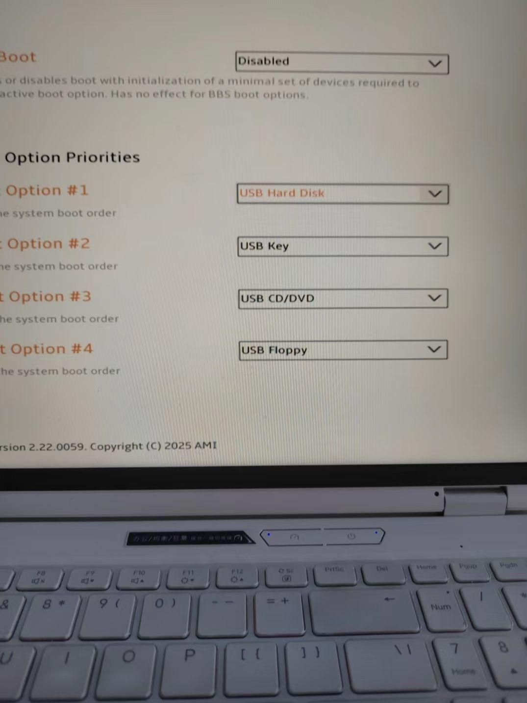
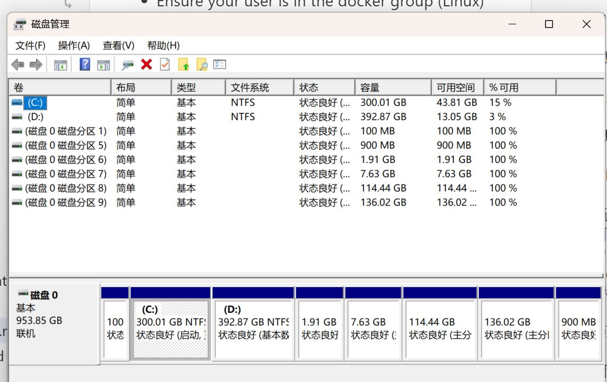
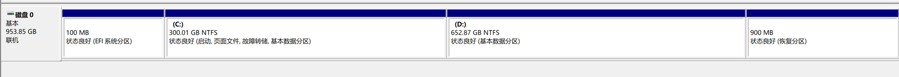

正好是一年前的这几天，亲手为自己的windows电脑安装了占250GB的ubuntu双系统，当时还不懂什么swap,什么分区，甚至不知道最后效果会如何，有没有更好的方案，只是一味根据教程照做，生怕把硬盘搞坏。一年后的今天，我还算游刃有余地在BIOS里把windows boot manager和usb hard disk放到第一位，拿掉ubuntu,把分区“还给”D盘。一年前还不知道双系统根本没有WSL香，在ubuntu系统上开发很好很方便，我在windows上所有的开发也都在wsl ubuntu24上做，但ubuntu不适合作为日常和人大量交互的os使用。使用把人的体验当做第一位的win，在win上用把开发生态兼容性当做第一位的linux，才是最优解。如果今天有人问我怎么安装linux系统（有不少学弟学妹来问过我），其实不用折腾虚拟机，双系统之类的东西，就简简单单的用wsl或者买一台轻量服务器ssh连接就好了，开发全在vscode。开箱即用，方便快捷，享受windows的交互体验。当然了，如果是mac就不用考虑那么多问题了[破涕为笑]。另外还有一件我后悔的事，除了没买mac之外，就是为什么当初拒绝2TB磁盘吧[心碎]。

