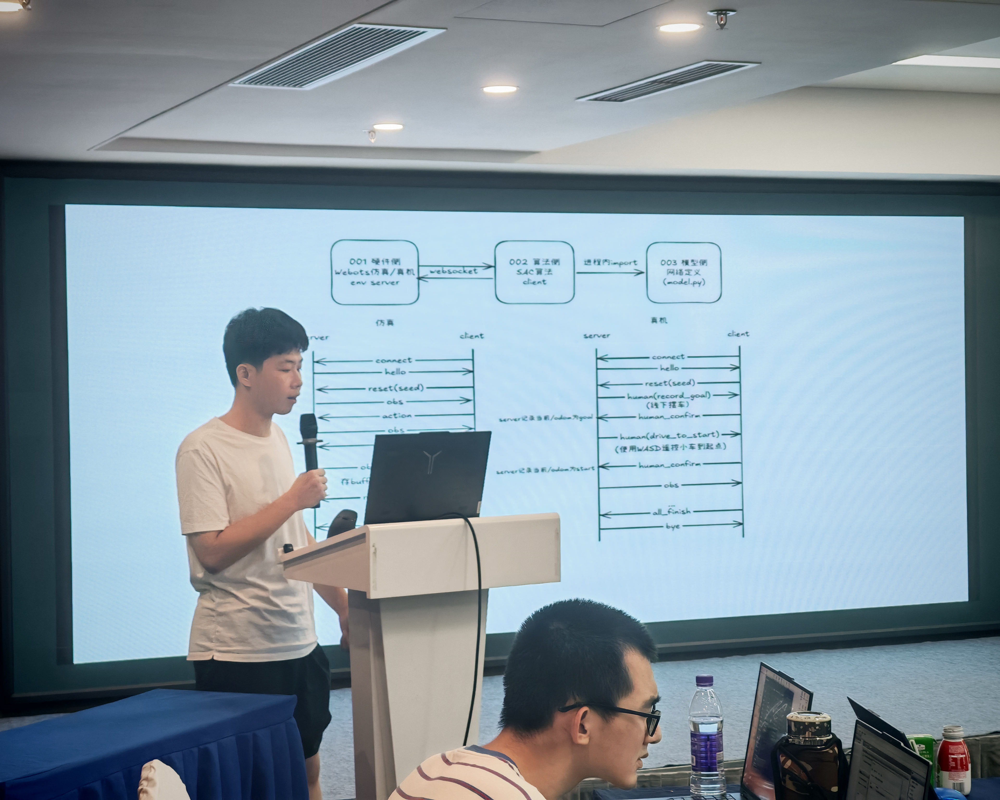
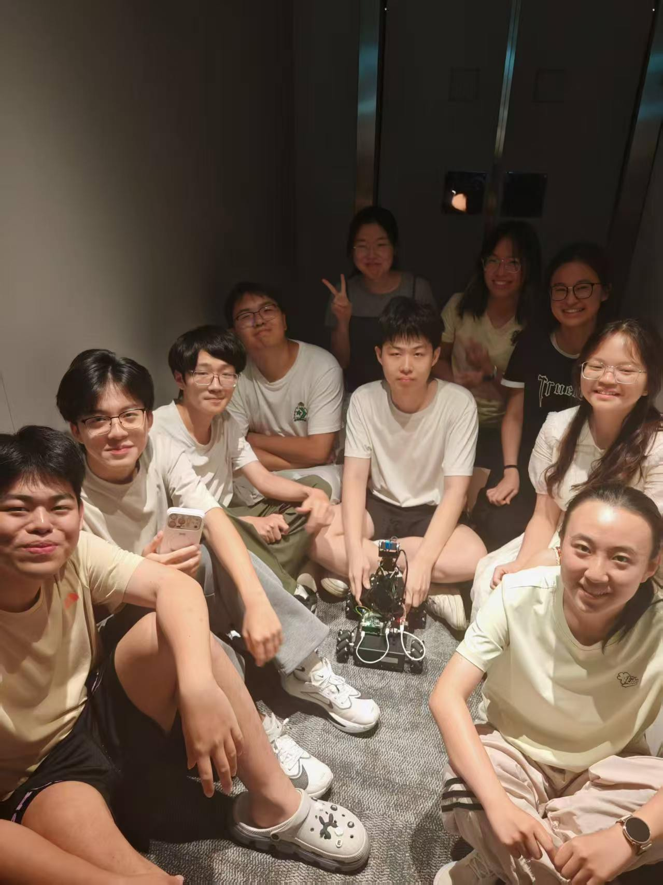
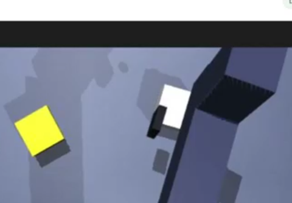

去年这个时候，我就以组长的身份参加了主要面向高年级本科生的线下论坛训练營，今年7.30-8.13是我第二次作为组长来参加，为时15天的线下训练营刚刚结束了。本科阶段，处于起步期（就像RL早期），进行较为广泛的探索，还是比较重要的。一年的时光飞逝，我也明显感受到了自己飞速的成长。来从3个角度（技术、团队管理、社交交流）做一个全面的总结吧。

---

1.关于三期做了什么（技术角度）：

第一期(7.30-8.3)主要是做embodied ai，由李德老师带队。我并不是搞具身方向的，我的组员也都是本科生，所以明显感觉会有些挣扎。尽管如此，我们团队还是探索了：目标检测、强化学习避障、3D点云建模、模仿学习、SLAM建图、语义分割、自动驾驶、机械臂逆运动学解析等基础实验，学习了SmolVLA的paper,并且完成了小车避障和机械臂定位移动的具体真机实验。
<video controls width="600" src="260813-2026年暑假论坛实践总结.assets/115cf106cc3d18c68cdbf036d9cdbd19.mp4"></video>

<video controls width="600" src="260813-2026年暑假论坛实践总结.assets/ebf23c11155e84a1245bb3f77280dfe6.mp4"></video>

<video controls width="600" src="260813-2026年暑假论坛实践总结.assets/af7e9f4b6093418110e02c0dcb650a78_raw.mp4"></video>

  
  

第二期(8.4-8.8)主要是做embodied ai + agentic ai的结合。第二期的带队老师是CMU的Phd邓侃老师。我们做的是无人机内的具身agent，由openclaw驱动。我对于agentic ai比较熟悉，这期明显舒适了一些。我们组有个同学有很多嵌入式开发的经验，他出色完成了电脑连接无人机真机的任务。我们做了一些数据采集、微调模型的工作。另外，邓侃老师告诉我们为什么要读名校的phd，他说是因为这些名校都有前人留下来的管线、资产，因此研究速度会加速。我认为各有好处，使用前人的资产，可以加速研究，而自己从零搭起，可以对pipeline理解更透彻、更熟悉。为了做好平衡，我认为面对资产，自己可以用轻量级别的MVP做练手就可以，真的做实验还是要直接复用，面对自己从零搭建资产，把这当成一次从底层搭建起来锻炼的好机会。

<video controls width="600" src="260813-2026年暑假论坛实践总结.assets/eb4db8ad160db3537e946cebdc438053.mp4"></video>

  
  

第三期(8.9-8.13)是做agentic ai的，分两小期，第一天是MSRA的张楚珩老师带队，第二天是MSRA的黄颂老师带队。第三期老师让我们组和另一个基础组的同学合并交流。于是我需要管理接近20人的团队。前两天可以做一些agentic ai和embodied ai相结合的事，后三天是做rag、信息检索。我们前两天做了一个语音智能体控制机械臂的项目：

<video controls width="600" src="260813-2026年暑假论坛实践总结.assets/be0f0b0e69956e8e7a8c0f84bc188fc6.mp4"></video>

张老师说还挺流畅的，就是不知道为啥他觉得白色的没放对，我的一个负责该部分的组员研究了一下，发现是 camera2 的摆放角度有问题，在那个地方看不到机械臂和物块的相对位置，这里，

摄像头依旧判定夹爪与物块未分离，于是返回释放失败，判定分离有四个条件，必须同时满足，物块是否仍然被抬起，物块是否仍在末端附近，手指-物块是否还有接触，Camera2 第三视角验证，这个问题可以归结为审核过于严苛，也可以归结为摆放位置不合理，但是我们认为审核严苛并不是一个坏事，因此这个问题调整 camera2 位置即可解决。张老师说他理解了，可以尝试一下多视角输入。时间短暂，这块我们暂时还没来及改进。

后三天我们做了一个OpenEvidence风格的证据智能助手的MVP，我大三上的时候探索过rerank，知道有pointwise、pairwise、listwise三种方式。我们的主要架构思路很简单：

---

2.关于团队管理

①一个人强不是真的强，一个人赋能团队，让团队产出效率最大化，才是真的强。

我认为一个好的团队思维的人，应该具备这些特质：

第一是，三人行，必有我师焉。

第二是，把命令改为探讨。不要说“你去xx吧”，而是“你觉得xxx怎么样？你怎么看？”让团队集思广益。

第三是，失败时主动内归因。发自内心反思，表态“如果我能在xx上做得更好一些，事情或许会不一样”。

第四点尤为重要，为他人创造上升的条件和信心。切忌因为我的存在让对方束手束脚。让每个人在舒适、喜欢的 vibe 里野蛮生长，激发每个人的潜能。

第五点是懂得感恩。如果感觉到愉悦舒适，请感激每个人为你的牺牲。

当其他人和这样一个思维的成员合作后，他们会被尊重、被倾听、犯错不会被甩锅、成长会被托举、牺牲会被感激，迸发出惊人的创造力。这是从单兵作战到团队作战的关键一跃。

②另外，团建真的非常必要。很多时候，大家只是缺少一个互相深入了解的机会。团建之后，团队的氛围会明显上升一个层次。

③另外，当组织的人数比较小的时候，“人治”做主导是非常重要的，当组织人数变得庞大，“规则”或者“KPI”才应该做主导。两个团队，一个团队的氛围好但是人均水平一般，一个团队的氛围
不好但是各个能力很强，大概率前者产出效率更高，且人数越多越体现这点。

---

3.关于社交交流

我认为任何线下活动，内容本身很重要，但只是一部分而已。线下活动一个非常重要的点是：它是让你来交朋友的。甚至有些活动，内容本身不如交朋友重要。

我在训练营里认识了来自多个985、211的同学，包括来自清华、上交、南大、哈工深、电子科大、西工大、北师大、华东师范、南开、中南、山大、吉大、大工、东大、中传等一系列学校的同学。和他们建立联系和交集，我认为这是一笔宝贵的财富。

---

**综上**

我马上就要开启读博的新征程，未来可能不再有那么多时间探索这么多方向和课题，但是我已经找到了自己比较感兴趣的方向（语音）并计划深造，这些宝贵的探索经历也会丰富我的基础知识面和综合素养。和这么多优秀的同学、家长、老师们在短短15天做的交流，让我受益匪浅。我也帮助了许多需要我帮忙的同学和家长朋友们。在这里我向同学、家长和老师（尤其是组织者刘俊明老师）的付出与合作表示感谢。我发现当今的本科生同龄人，大家有一股蓬勃的朝气。有时候我们只是缺少大量好的input,读的paper，研究的工程还不够多，所以品味还不够好。没关系，这需要研究生阶段我们自己和导师不懈的努力。希望大家保持这股朝气！我认为一个优秀的人，应该是 技术实力 x 团队思维 x 社交交流 x 大量好的输入 x 自驱努力 x 收敛产出 x 独特生态位 的结合态，单一“模态”在今天的AI时代是不够的。

希望未来我能成为这样优秀的人！成为更优秀的人！共勉！