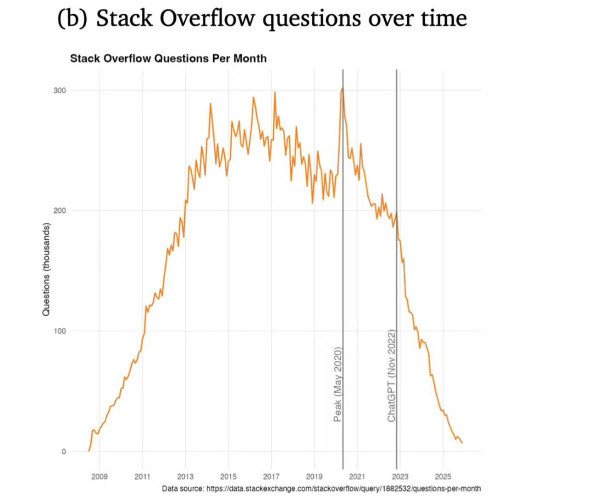

# Survival in the Era of High Uncertainty: The Cognitive Shift from Line-by-Line Coding to Managing Certainty

As AI takes over more tasks, where does human value lie? Let's look at the industry frontier: in 2026, multi-agent systems have begun to land. OpenAI iterated the new **GPT-5.3 Codex** using agents, and Claude’s **Opus 4.6** significantly enhanced its agentic capabilities, becoming the premier base model for **Claude Cowork**—a product launched this January for non-programmers. As AI systems grow more complex, they handle not just coding, but the entire software engineering (SE) lifecycle: deployment, testing, O&M, and monitoring. This expansion is rapidly touching every sector—entertainment, education, office work, and daily life.

As systems become more complex and capable, uncertainty increases exponentially. In the real business world, iteration speed is life. With AI doing 80% of the work, the demand for high quality and rapid iteration has skyrocketed. However, humans struggle to adapt to this "High Uncertainty" because the volume of AI-generated content in short timeframes has exceeded the physiological limits of human oversight.

The core value of humans in the future lies in **the ability to manage certainty within high uncertainty.** Traditional SE was always about this, but AI has intensified the challenge. In large-scale systems, we must trust robust testing rather than line-by-line analysis. No human can analyze every line anymore. This is counter-intuitive to beginners who think they must "understand every line," but in real-world scenarios, that is simply impossible. AI has made this reality unavoidable. Therefore, the best way to manage high uncertainty is the same as in traditional SE: **excellent testing.** In the AI era, you don’t even need to write the tests yourself; you need the experience to direct AI to build them. Human value now lies in the ability to establish **reusable verification systems** and managing uncertainty in extremely short windows.

The disruption of SE by AI is a fait accompli. AI is even impacting the open-source ecosystem. Some argue AI might "ruin" open source by reducing meaningful human interaction. While **"Vibe Coding"** boosts short-term productivity, it might degrade the overall system quality in the long run. On GitHub, humans are already losing ground to AI. According to SemiAnalysis, Anthropic’s **Claude Code** already accounts for 4% of public commits and is projected to reach 20% of daily commits by the end of 2026.

People now have a much higher threshold for what constitutes a "good product." In the future, the competition won't be about who builds a "toy" faster, but who can achieve extreme product refinement in the shortest time. First-mover advantage is yielding to **product experience.** This aligns with our economic shift: the past 30 years were about making money from development; the next 30 will be about winning through "struggle" and superior experience. Therefore, a core human value will be the **practice of perfection and high standards.**

Many can build an app in a few days now, but the subsequent refinement—security (rate limiting, IP blacklists, bot protection, CSRF), scalability, and maintenance—is where the real pain (and value) lies. Even if AI makes documents and tests easy to generate, the **connection and correction** of these elements still demand massive mental effort. While "premature optimization is the root of all evil" for an MVP, the future belongs only to those who can deliver high-quality, polished products.

These rules and insights may change in a few years. It’s better not to overthink the next five years, but rather to plan and adapt within a five-year horizon. Constant learning and thinking are the only ways to handle this rapid transformation. This, perhaps, is the ultimate core value of a human.

