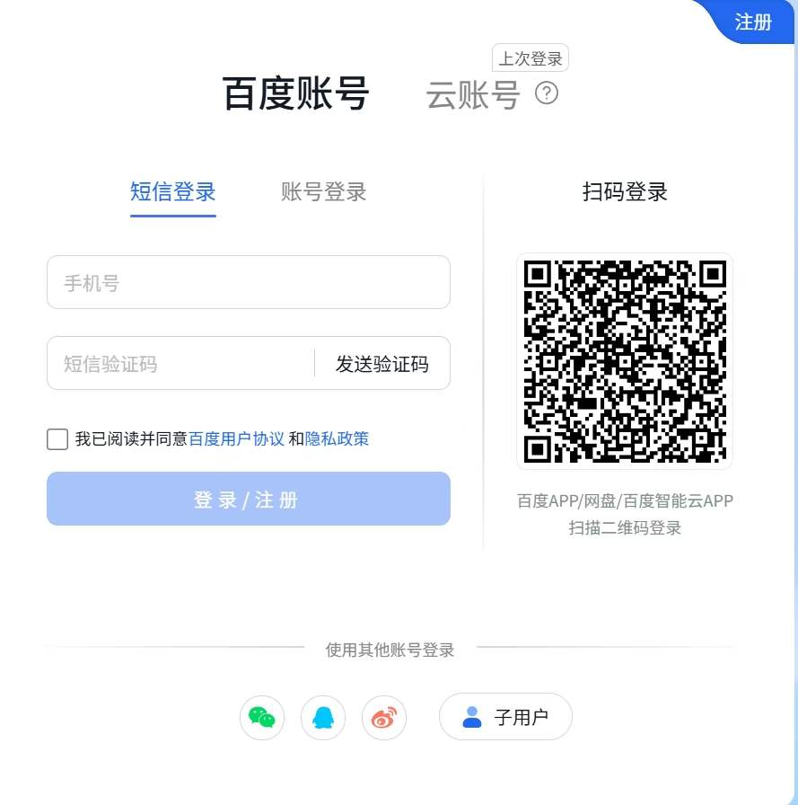
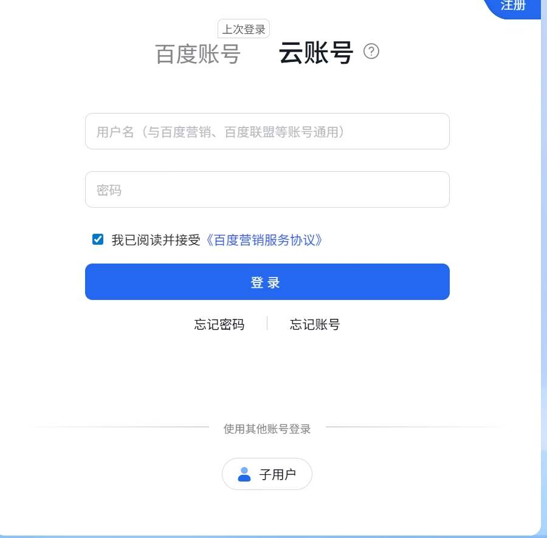

After buying a server on Tencent Cloud, I wanted to buy another, and to enjoy a different vendor's new-user discount, I picked the cheapest option — JD Cloud. The experience on JD Cloud was nowhere near Tencent Cloud's; even the DDoS protection allowance was tiny. Later, I wanted yet another server — gotta keep cashing in those new-user discounts — and after comparing several vendors I went with Baidu AI Cloud. That choice turned out to be quite the experience. Baidu AI Cloud and JD Cloud are about equally bad, but then something even more absurd happened.

A few days after buying the server, I went to the console to check on it and discovered the server was *gone*. Yet I could still log in to it remotely via SSH. Bizarre! I dug around for a long time, confirmed that the server I cherished really was missing from the console, and even started doubting myself: was the server even on Baidu AI Cloud? Did I misremember? Did I log in with the wrong account? I first SSH'd into the server and checked its metadata — it really was Baidu's. Then I logged in to Baidu AI Cloud both via WeChat and via my phone number, and confirmed it was the same account; I had paid via WeChat originally, and the account had passed real-name verification — there was no mistake. I was completely lost.

After much head-scratching, I phoned Baidu AI Cloud customer support. The connection was crackling and the audio quality was awful — I had to strain to hear. The agent told me that one phone number can be bound to *both* a Baidu account and a Baidu Cloud account, and at login, the two are different. My server was under the **Baidu Cloud account**, not the **Baidu account**. I had actually noticed during initial setup that there were two account types, but the Baidu account requires phone-number login (and WeChat-QR-code login also defaults to the Baidu account), whereas the Baidu Cloud account requires a *username* — and that mismatch caused a serious misinterpretation. Since I had registered for Baidu AI Cloud using my phone number, I naturally assumed that meant the Baidu account. I'd long forgotten what username I'd set for the Baidu Cloud account. I had to use the "forgot account" function on the Baidu Cloud account to look up the username corresponding to my phone number, *then* log in to the Baidu Cloud account, and *then* see my beloved server in the console.

Baidu AI Cloud's account system is a mess. The cloud account can only be logged in with a username, while the Baidu account uses a phone number — this caused a serious misjudgment. WeChat-QR-code login even defaults to the Baidu account. If I hadn't called customer support to clarify, I'd probably have been stuck for ages. [laughing through tears] On top of that, Baidu AI Cloud's web console is laggy — pages are slow, and sometimes don't load at all. As the saying goes: people don't recognize quality, but money does.

