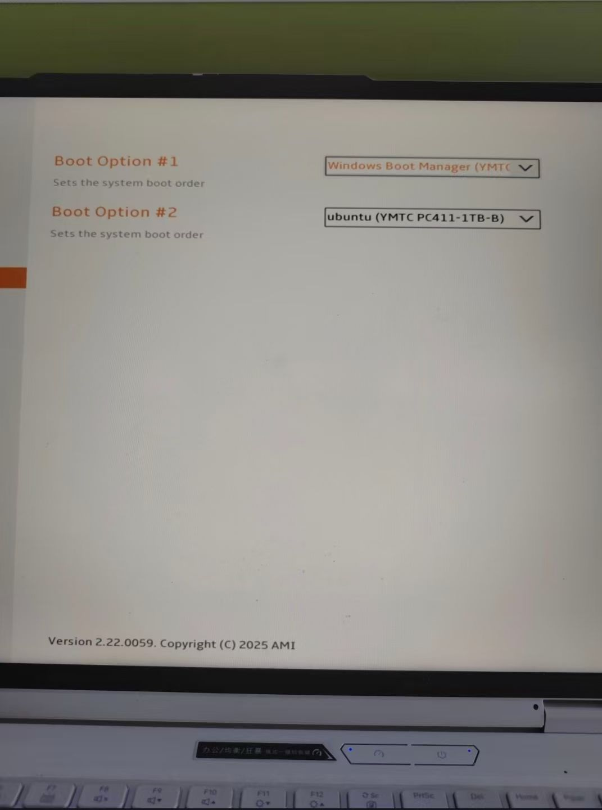
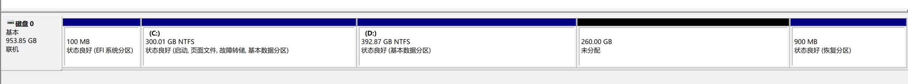

Exactly one year ago around these days, I personally installed a 250GB Ubuntu dual-boot system on my Windows machine. Back then, I didn't understand what swap was, what partitions were — I didn't even know what the final result would look like, or whether there were better options. I just followed the tutorial step by step, terrified of bricking my hard drive. A year later, I can fairly comfortably enter the BIOS, put Windows Boot Manager and USB Hard Disk to the top, remove Ubuntu, and "return" the partitions to the D drive.

A year ago, I didn't know that WSL beats dual-boot hands-down. Developing on an Ubuntu system is great and convenient — all my Windows development is now done on WSL Ubuntu 24. But Ubuntu is not the right OS for daily interaction with people. **Use Windows, which puts user experience first, and on Windows use Linux, which puts dev ecosystem compatibility first** — that is the optimal solution.

If anyone asks me today how to install a Linux system (quite a few juniors have asked me): don't bother with virtual machines, dual-boots, or anything like that. Just use **WSL** or rent a lightweight cloud server and connect via SSH. Do all your development inside VS Code. Out of the box, easy and fast, while enjoying the Windows interaction experience. Of course, if you have a Mac, none of this is a problem [laughing through tears].

On a separate note, one other thing I regret — besides not buying a Mac — is why I ever said no to that 2TB drive [broken heart].

