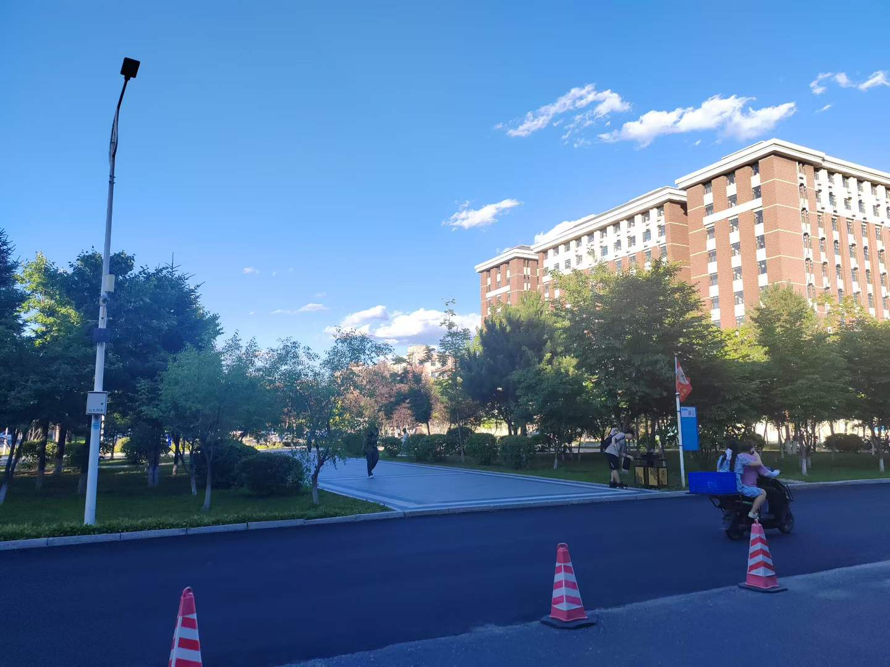
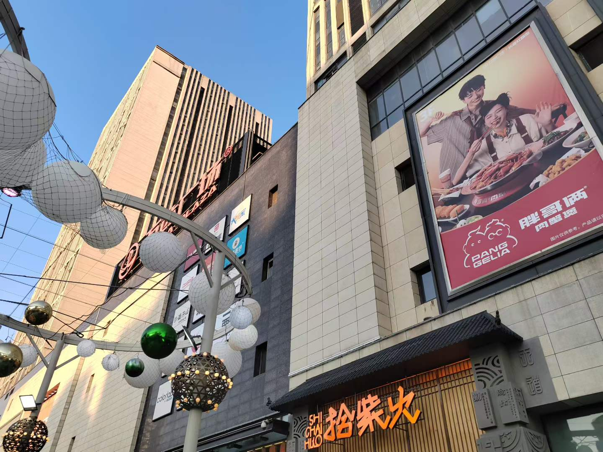

Every time I play basketball at Jilin University, I see an auntie carrying a small bag filled with bottled water and sports drinks—Gatorade, Mizone, you name it. From freshman to junior year, Aunt Fangfang has quietly accompanied us through three years of sweat and laughter on the court. I can't count how many times I forgot to bring water or ran out during practice or a game. Usually everyone is too exhausted to walk to the supermarket, so we just buy from her. Yesterday afternoon, I was playing with friends, then went to dinner and realized my meal card was missing. I went back to the court to look for it. I asked Aunt Fangfang if she had seen it. She said no, but she would keep an eye out for me. She didn't know that replacing a meal card is just a few minutes at a self-service machine. She even said if I couldn't find it, I could use the card from her home.

It so happens that my time at Jilin University is now counting down. In this moment, I suddenly recall all those times over the past three years when I saw her at the basketball court. Some people in life are just passers-by. They are often beside you, yet you barely notice them. You may even take their presence for granted. And they usually leave without saying goodbye. But it is exactly these people who make up countless warm and beautiful memories in our lives.

