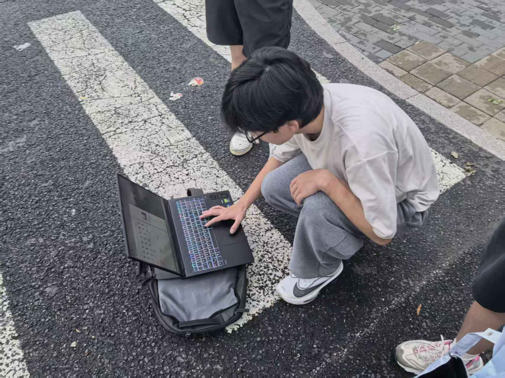
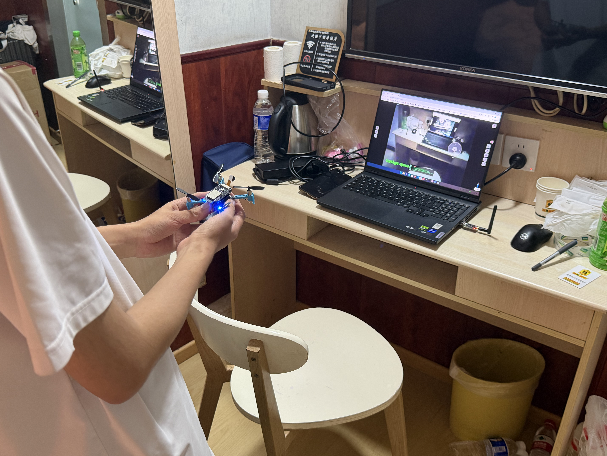
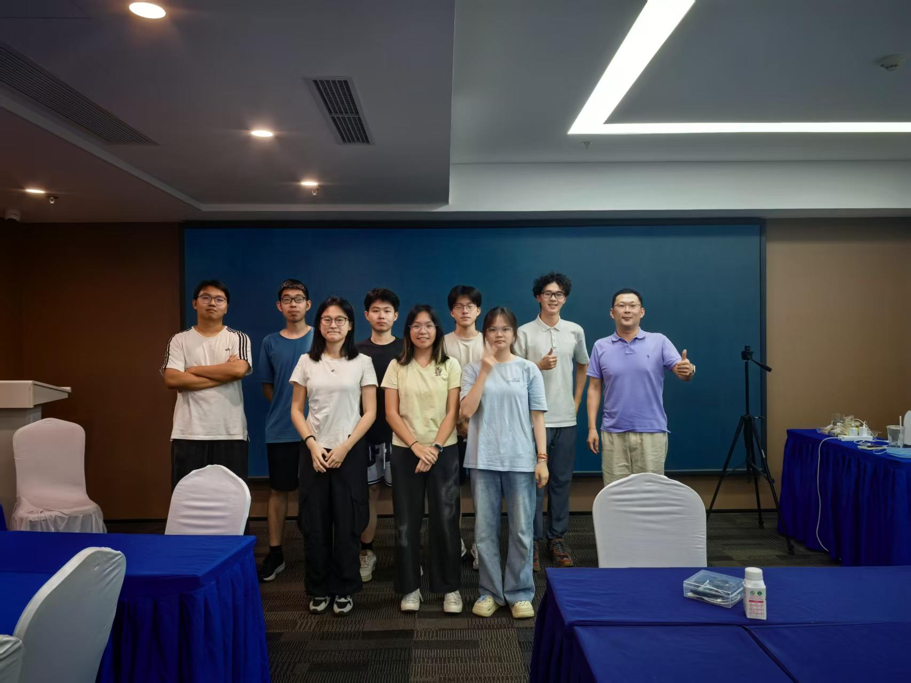
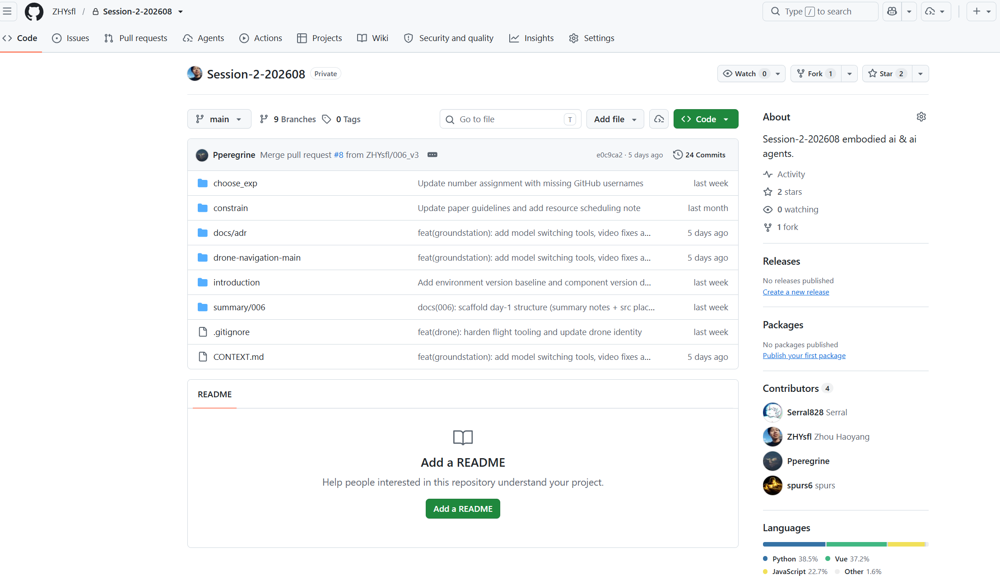
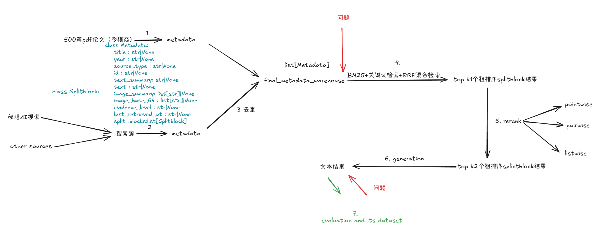
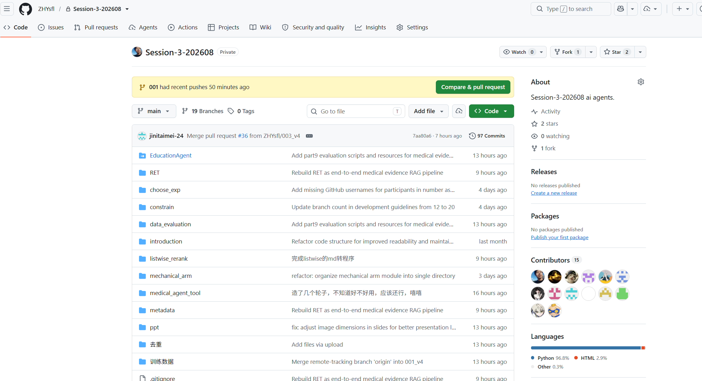
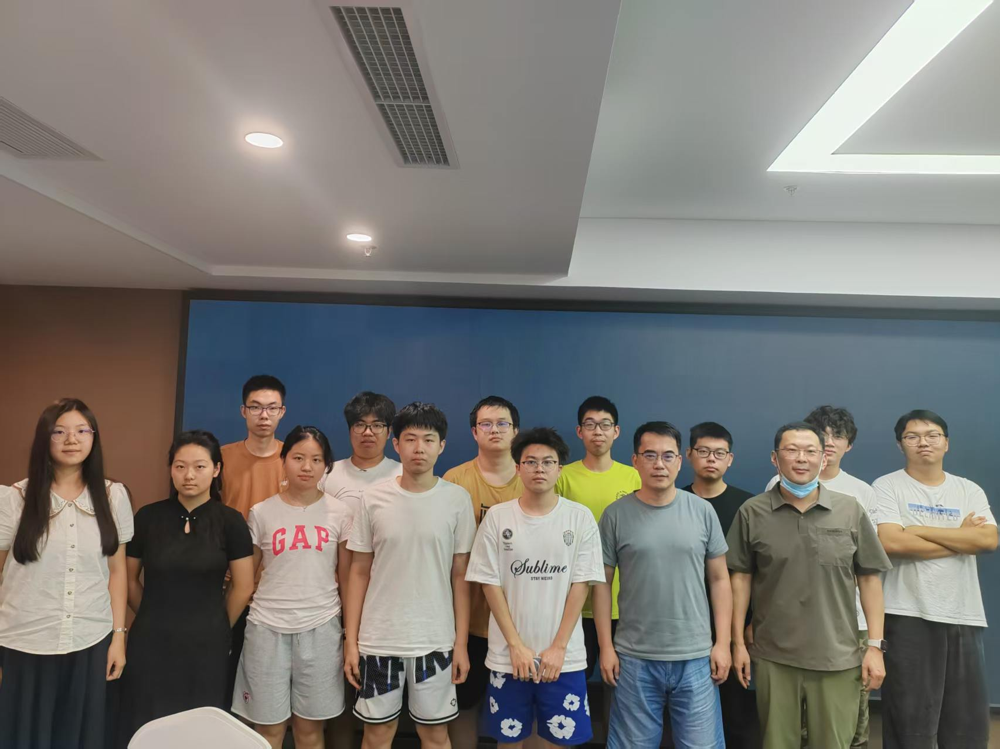

Around this time last year, I joined an offline forum training camp—mainly aimed at upper-year undergraduates—as a team leader. This year, from July 30 to August 13, was my second time attending as a leader, and the 15-day offline camp has just come to an end. During one's undergraduate years, when you're still in the early stages (like the early phase of RL), broad exploration is quite important. A year has flown by, and I can clearly feel how rapidly I've grown. Let me do a comprehensive retrospective from three angles: technology, team management, and social connection.

---

1. What we did across the three sessions (the technical side):

Session 1 (7.30–8.3) focused on embodied AI, led by Prof. Li De. I don't work on embodiment myself, and my team members were all undergraduates, so the struggle was palpable. Even so, our team explored a set of foundational experiments—object detection, RL-based obstacle avoidance, 3D point cloud modeling, imitation learning, SLAM mapping, semantic segmentation, autonomous driving, and analytical inverse kinematics for a robotic arm. We studied the SmolVLA paper, and completed real-robot experiments: obstacle avoidance with a small car, and positioning and moving with a robotic arm.

<video controls src="./260813-2026-Summer-Forum-Training-Camp-Retrospective.assets/115cf106cc3d18c68cdbf036d9cdbd19.mp4" title="Title"></video>

<video controls src="./260813-2026-Summer-Forum-Training-Camp-Retrospective.assets/ebf23c11155e84a1245bb3f77280dfe6.mp4" title="Title"></video>

<video controls src="./260813-2026-Summer-Forum-Training-Camp-Retrospective.assets/af7e9f4b6093418110e02c0dcb650a78_raw.mp4" title="Title"></video>

Session 2 (8.4–8.8) combined embodied AI with agentic AI, led by Dr. Kan Deng, a CMU PhD. We built an embodied agent inside a drone, driven by openclaw. Since I'm fairly familiar with agentic AI, this session felt noticeably more comfortable. One of our teammates had extensive embedded development experience and did an excellent job connecting a laptop to the real drone. We also did some data collection and model fine-tuning. In addition, Dr. Deng told us why one should pursue a PhD at a top school: these schools have pipelines and assets left behind by predecessors, so research moves faster. I think both approaches have their merits. Reusing existing assets accelerates research, while building everything from scratch gives you a deeper, more thorough understanding of the pipeline. To strike a balance, my view is: when facing existing assets, practice with a lightweight MVP, but for real experiments, reuse directly; when facing the chance to build assets from scratch, treat it as a valuable opportunity to build things up from the ground floor.

<video controls src="./260813-2026-Summer-Forum-Training-Camp-Retrospective.assets/eb4db8ad160db3537e946cebdc438053.mp4" title="Title"></video>

Session 3 (8.9–8.13) was about agentic AI, split into two halves: the first half was led by Prof. Chuheng Zhang from MSRA, the second by Prof. Song Huang from MSRA. In this session, the instructors merged our group with another, more foundational group for exchange, which meant I had to manage a team of nearly 20 people. The first two days were for projects combining agentic AI with embodied AI; the last three days focused on RAG and information retrieval. In the first two days, we built a voice-controlled agent that operates a robotic arm:

<video controls src="./260813-2026-Summer-Forum-Training-Camp-Retrospective.assets/be0f0b0e69956e8e7a8c0f84bc188fc6.mp4" title="Title"></video>

Prof. Zhang said it ran quite smoothly, though he couldn't figure out why the white block seemed to be placed incorrectly. The teammate responsible for that part looked into it and found that the issue was camera2's mounting angle—from that position, the relative position of the arm and the block couldn't be seen. Here:

the camera still judged the gripper and the block as not separated, so it returned a release failure. The separation check has four conditions, all of which must hold simultaneously: whether the block is still lifted, whether the block is still near the end effector, whether finger–block contact remains, and third-person verification from camera2. You could attribute the problem to an overly strict review policy, or to an unreasonable mounting position—but we don't think strict reviewing is a bad thing, so simply adjusting camera2's position solves it. Prof. Zhang said he understood and suggested trying multi-view input. Time was short, so we didn't get around to improving this part.

In the last three days, we built an MVP of an OpenEvidence-style evidence assistant. Back in the first semester of my junior year, I explored reranking and learned about its three paradigms: pointwise, pairwise, and listwise. Our main architectural idea was simple:

---

2. On team management

① One person being strong isn't real strength. Empowering the team and maximizing its output—that's real strength.

I believe someone with a genuine team mindset should have these traits:

First, when three people walk together, one of them can always be my teacher.

Second, turn commands into discussions. Don't say "go do X"; say "what do you think about X? What's your take?" Let the team pool its wisdom.

Third, when things fail, attribute the cause inward first. Reflect sincerely, and say "if I had done better on X, things might have turned out differently."

Fourth—and this matters most—create the conditions and the confidence for others to rise. Never let your presence make others feel constrained. Let everyone grow wildly in a vibe they find comfortable and enjoyable, and bring out each person's potential.

Fifth, be grateful. If you feel happy and at ease, thank everyone for the sacrifices they made for you.

When people work with a teammate who thinks this way, they feel respected, heard, never blamed for mistakes, lifted up as they grow, and appreciated for their sacrifices—and they unleash astonishing creativity. This is the critical leap from solo fighting to team fighting.

② Team-building activities are truly essential. Often, people simply lack an opportunity to get to know each other deeply. After a team-building event, the team's atmosphere visibly rises to a new level.

③ When an organization is small, leading by personal character should dominate; only when the organization grows large should "rules" or "KPIs" take the lead. Given two teams—one with a great atmosphere but average individual ability, the other with a poor atmosphere but strong individuals—the former will most likely produce more, and the larger the teams, the more this shows.

---

3. On social connection

For any offline event, the content itself matters, but it's only part of the picture. A hugely important point of offline events is this: they are for making friends. For some events, making friends matters even more than the content itself.

At this camp, I met students from many 985 and 211 universities—including Tsinghua, SJTU, Nanjing University, HIT Shenzhen, UESTC, NPU, BNU, ECNU, Nankai, CSU, SDU, Jilin University, DUT, NEU, CUC, and more. Building connections and intersections with them is, I believe, a treasure.

---

**In summary**

I'm about to embark on a new journey as a PhD student. In the future I may no longer have as much time to explore so many directions and topics, but I've found the direction I'm genuinely interested in and plan to go deep, and these precious exploration experiences will enrich my foundational knowledge and overall capabilities. The exchanges I had with so many outstanding fellow students, parents, and teachers in just 15 days benefited me enormously. I also helped many students and parents who needed my help. Here, I want to thank every student, parent, and teacher for their dedication and collaboration. I've noticed that today's undergraduates—my peers—carry a vigorous energy, but they still lack a large volume of good input: they haven't read enough papers or studied enough engineering work, so their taste isn't sharp enough yet. That's fine—it takes persistent effort from both themselves and their advisors during graduate school. I hope everyone keeps that energy! In my view, an outstanding person is a combined state of: technical strength × team mindset × social connection × a large volume of good input × self-driven effort × convergent output.

I hope I can become such an outstanding person in the future! Let's encourage each other!
